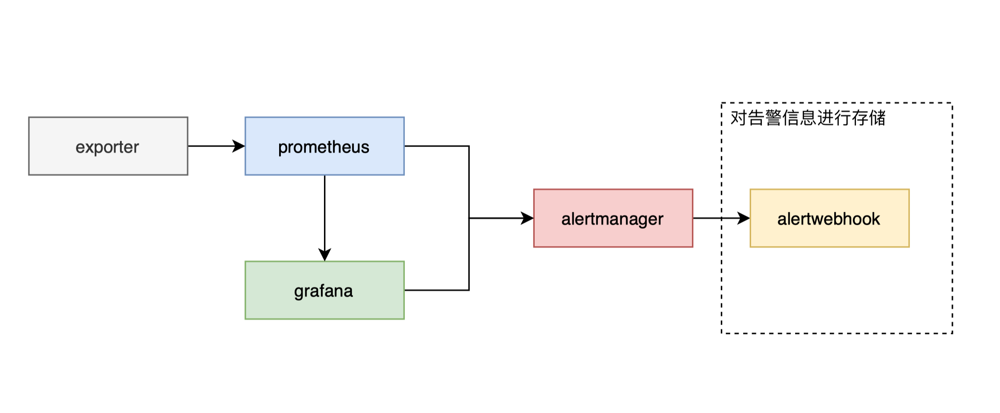

# alertwebhook

该Demo为对接Prometheus Alertmanager 的webhook。
通过使用govendor进行依赖包管理。

> alertwebhook_alertlevel为告警指标对应的告警级别，9为告警最高级，0为告警最低级，在发生告警风暴的时候可以根据不同的告警级别一次进行排障。

## 架构图


## 本地部署

**1. 拉取代码**

```shell
git pull git@github.com:wangjc0216/alertwebhook.git
```
**2. 通过Dockerfile在本地构建alertwebhook镜像**

```shell
docker build -t alertwebhook:1.1 .
```
**3.docker-compose 部署**

```shell
docker-compose up -d 
```
**4.验证**

通过docker logs 查看 alertwebhook的日志，看是否运行正常。

进入到alert-mysql容器中对表结构进行检查。


## 实现原理

在prometheus和grafana可以设置告警规则，当metrics指标达到告警阈值的时候，服务端会发出告警信息到Alertmanager。
Alertmanager是一个管理告警信息的服务，有对告警信息执行静默、抑制等功能，也可以通过Email、webhook等方式发送告警信息。

alertwebhook是一个简单的web服务，通过对AlertManager发送过来的告警信息进行对应数据库的写入和更新实现。

## 当前问题

- [ ] 2021.2.23 当前配置变量都是以环境变量的方式导入到容器中的，那么当我更新环境变量的时候需要重启容器（就我目前了解到的而言），那么实现热加载就有一些问题了。
看起来只能使用配置文件映射到容器的方式实现热加载
  
